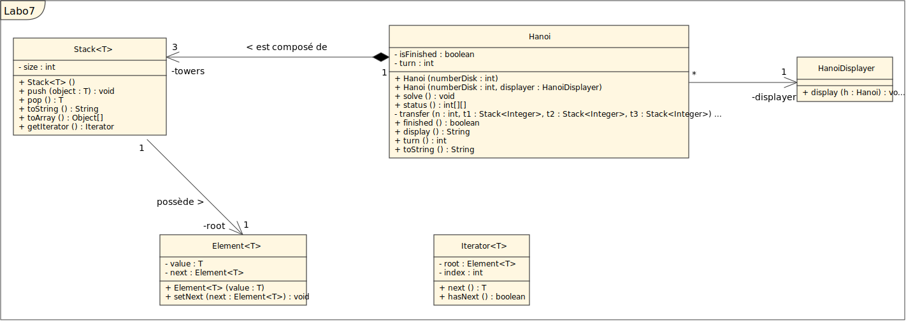

# Rapport labo 7 - Tours de Hanoï
Auteurs : Luca Coduri et Chloé Fontaine

Date : 01.12.2021

## Diagramme de classe

## Description des classes
### Hanoi
La classe Hanoi est la classe permettant de résoudre le problème des trois tours de Hanoi. 

Elle comprend deux constructeurs :
- Un constructeur prenant en argument uniquement le nombre de disques de la première tour. Ce constructeur utilise le displayer par défaut de la classe Hanoi.
- Un deuxième constructeur prend en argument le nombre de disques de la première tour ainsi qu'un displayer. Si le constructeur est null, rien ne sera affiché.

Cette classe met à disposition les méthodes suivantes :
- solve : résoud le problème des tours de Hanoi. 
- finished : informe de l'état de terminaison de la résolution du problème.
- display : affiche l'état des tours de Hanoi.
- turn : retourne le nombre de tours déjà déroulés. 

### Stack
La classe Stack implémente une pile générique. Elle propose les méthodes suivantes : 
- push : permet d'ajouter un élément à la pile.
- pop : permet d'obtenir l'élément du sommet de la pile et de le retirer de cette dernière.
- toArray : permet d'obtenir la pile sous forme de tableau, l'élément du sommet de la pile était le premier élément du tableau.
Attention : cette méthode retourne un tableau d'Object et non d'éléments du type de la pile générique.
- getIterator : retourne un itérateur sur le sommet de la pile (de notre propre classe Iterator et non de la librairie Java).

### Element
La classe Element est générique et est utilisée par la classe Stack pour implémenter ses éléments. Elle implémente les fonctions suivantes :
- Un constructeur prenant par paramètre la valeur de l'élément à créer.
- getNext : retourne l'élément suivant l'élément en question.
- setNext : remplace l'élément suivant de l'élément en question par celui passé par paramètre.

### Iterator
La classe Iterator implémente un itérateur utilisé par la classe Stack. Elle comporte les fonctions suivantes :
- Un constructeur prenant par paramètre l'élément référencé par l'itérateur. L'itérateur pointera en réalité sur un élément de valeur null dont le prochain élément est celui passé par paramètre au constructeur.
- hasNext : retourne true s'il existe un élément après celui référencé par l'itérateur.
- next : fait avancer l'itérateur de un élément et renvoie la valeur de ce dernier (null s'il n'existe pas).

### HanoiDisplayer
La classe HanoiDisplayer implémente le comportement de l'affichage de la résolution des tours de Hanoi. Elle ne propose qu'une seule fonction "display" qui affiche sur la console les différentes étapes de la résolution du problème.

## Description de l'algorithme
En ce qui concerne l'algorithme choisi pour la résolution des tours de Hanoi, nous nous sommes inspirés du chapitre

## Réponse à la question
En supposant des moines surentraînés capables de déplacer un disque à la seconde, combien de temps
reste-t-il avant que l’univers disparaisse (celui-ci a actuellement 13.8 milliards d’années) ?

## Sources
